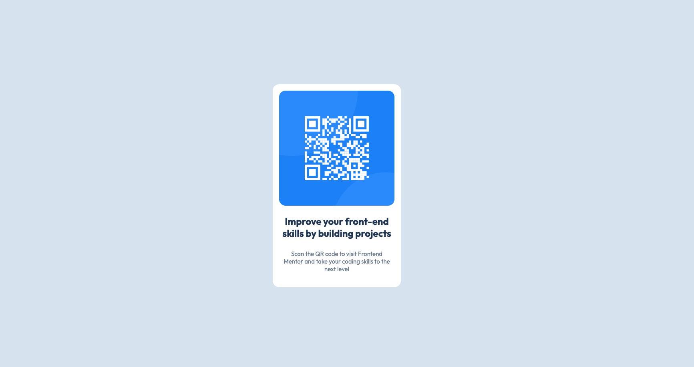

# Frontend Mentor - Blog preview card solution

This is a solution to the [Blog preview card challenge on Frontend Mentor](https://www.frontendmentor.io/challenges/blog-preview-card-ckPaj01IcS). Frontend Mentor challenges help you improve your coding skills by building realistic projects. 

## Table of contents

- [Frontend Mentor - Blog preview card solution](#frontend-mentor---blog-preview-card-solution)
  - [Table of contents](#table-of-contents)
  - [Overview](#overview)
    - [The challenge](#the-challenge)
    - [Screenshot](#screenshot)
    - [Links](#links)
  - [My process](#my-process)
    - [Built with](#built-with)
    - [Something I Want to Note](#something-i-want-to-note)
    - [What I learned](#what-i-learned)
    - [Continued development](#continued-development)
    - [Useful resources](#useful-resources)
  - [Author](#author)
  - [Acknowledgments](#acknowledgments)

## Overview

### The challenge

Users should be able to:

- See hover and focus states for all interactive elements on the page

### Screenshot

### Links

- Solution URL: [solution URL](hhttps://github.com/dannyshi01/frontend-mentor-challenge/tree/main/qr-code-component-main)

- Live Site URL: [live site URL](https://dannyshi01.github.io/frontend-mentor-challenge/qr-code-component-main/index.html)

## My process

### Built with

- Semantic HTML5 markup
- CSS custom properties
- Flexbox

### Something I Want to Note

nope

### What I learned

get to know how to use basic css selectot &  the settings of below

- basic using css 

### Continued development

Find more case to practice for understand the basic of frontend

### Useful resources

## Author

- Website - [Danny](https://dannyshi01.github.io/frontend-mentor-challenge/qr-code-component-main/index.html)
- Frontend Mentor - [@danny](https://www.frontendmentor.io/profile/dannyshi01)
  

## Acknowledgments

For this project I refer to 
Github - @vickbkl[https://github.com/vickbk/vickbk.github.io/blob/main/frontendmentor/blog-preview-card-main] for some css tricks and technics.
it helps a lot for me to know how others construct the challenge and having a model with the whole chanllenge