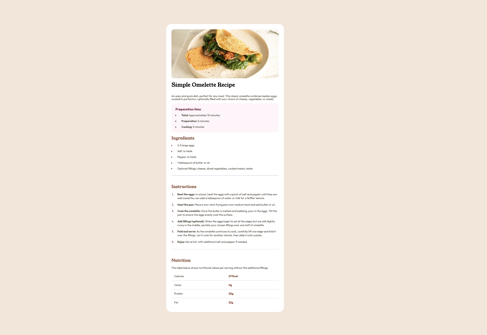

# Frontend Mentor - recipe-page-main

This is a solution to the [Blog preview card challenge on Frontend Mentor](https://www.frontendmentor.io/challenges/blog-preview-card-ckPaj01IcS). Frontend Mentor challenges help you improve your coding skills by building realistic projects. 

## Table of contents

- [Frontend Mentor - recipe-page-main](#frontend-mentor---recipe-page-main)
  - [Table of contents](#table-of-contents)
  - [Overview](#overview)
    - [Screenshot](#screenshot)
    - [Links](#links)
  - [My process](#my-process)
    - [Built with](#built-with)
    - [Something I Want to Note](#something-i-want-to-note)
    - [What I learned](#what-i-learned)
    - [Continued development](#continued-development)
    - [Useful resources](#useful-resources)
  - [Author](#author)
  - [Acknowledgments](#acknowledgments)

## Overview

### Screenshot

### Links

- Solution URL: [solution URL](https://github.com/dannyshi01/frontend-mentor-challenge/tree/main/recipe-page-main)

- Live Site URL: [live site URL](https://dannyshi01.github.io/frontend-mentor-challenge/recipe-page-main/index.html)

## My process

### Built with

- Semantic HTML5 markup
- CSS custom properties
- Flexbox 
- styling ul and ol
- styling table border

### Something I Want to Note

    table {
      width: 100%;
      /* make the border to collapse as one line */
      border-collapse: collapse;
      /* hidden the outside border (!! it has the most privilege so that i can correspond with the td border  attribution to render the only internal line) */
      border: hidden;
    }

    td {
      border-top: #ddd 1px solid;
      padding: 1rem;
    }

### What I learned

get to know how to use basic css selectot &  the settings of below

- flexbox
- the difference between grid and flexbox
- Usage of @media
- ol ul and it's css 
- table and it's css 

### Continued development

Find more case to practice for understand the basic of frontend

### Useful resources

- [mdn](https://developer.mozilla.org/zh-CN/docs/Web/CSS/) 
- [gemini](https://gemini.google.com/app/) - discussing with it and try and get to know some useful advise

## Author

- Website - [Danny](https://dannyshi01.github.io/frontend-mentor-challenge/recipe-page-main/index.html)
- Frontend Mentor - [@danny](https://www.frontendmentor.io/profile/dannyshi01)
  

## Acknowledgments
